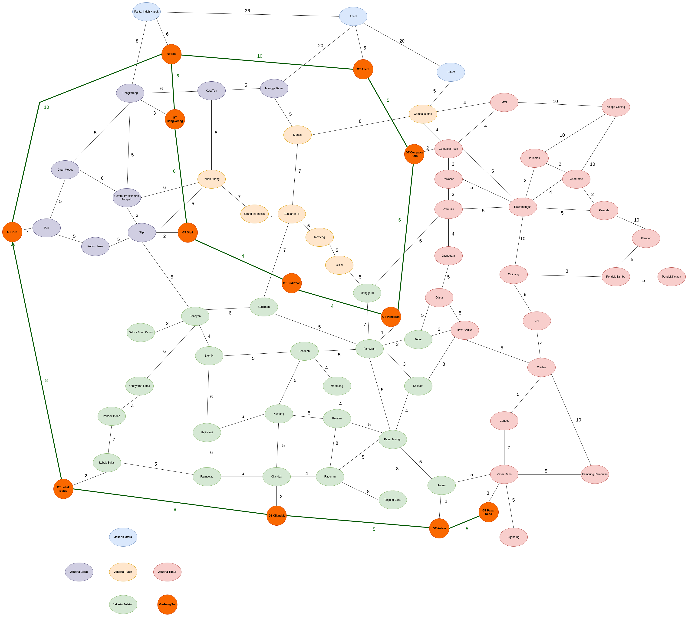

<!-- Improved compatibility of back to top link: See: https://github.com/othneildrew/Best-README-Template/pull/73 -->
<a name="readme-top"></a>
<!--
*** Thanks for checking out the Best-README-Template. If you have a suggestion
*** that would make this better, please fork the repo and create a pull request
*** or simply open an issue with the tag "enhancement".
*** Don't forget to give the project a star!
*** Thanks again! Now go create something AMAZING! :D
-->


<!-- PROJECT SHIELDS -->
<!--
*** I'm using markdown "reference style" links for readability.
*** Reference links are enclosed in brackets [ ] instead of parentheses ( ).
*** See the bottom of this document for the declaration of the reference variables
*** for contributors-url, forks-url, etc. This is an optional, concise syntax you may use.
*** https://www.markdownguide.org/basic-syntax/#reference-style-links
-->


<!-- PROJECT LOGO -->
<br />
<div align="center">
  <a href="https://github.com/robert-adit-sukoco/prolog-jakarta-maps">
    
  </a>

<h3 align="center">Prolog Jakarta Maps</h3>

  <p align="center">
    Jakarta pathfinding in Prolog
    <br />
    <br />
    <br />
    </p>
</div>


<!-- ABOUT THE PROJECT -->
## About The Project

"Prolog Jakarta Maps" is a project that is made as a mandatory final project for Prolog course in <em>Fasilkom UI</em> (Faculty of Computer Science, <em>Universitas Indonesia</em>). This project aims to demonstrate the implementation of pathfinding algorithm in Prolog, specifically Depth First Search. 

### Developers
* <a href="https://github.com/robert-adit-sukoco">Robertus Aditya Sukoco</a>
* <a href="https://github.com/calistavh">Calista Vimalametta Heryadi</a>
* <a href="https://github.com/zackhowisely">Zackho Wisely Darmawan</a>

### Built With

* Prolog

<p align="right">(<a href="#readme-top">back to top</a>)</p>


<!-- GETTING STARTED -->
## Getting Started

* Install Prolog. More details in <a href="https://wwu-pi.github.io/tutorials/lectures/lsp/010_install_swi_prolog.html">this page</a>.
* Run `swipl` in your Terminal / Command Prompt to enter the SWIPL terminal.
* Consult/read the `main2.pl` file in the SWIPL terminal.
```pl
?- consult('main2.pl').
true.
```
Note: Currently our `main.pl` is still not working as intended, `main2.pl` is our current main file.

<p align="right">(<a href="#readme-top">back to top</a>)</p>


<!-- USAGE EXAMPLES -->
## Get Shortest Path

```pl
?- get_shortest_route('Ancol', 'Cengkareng', Path, Duration).
Path = ['Ancol', 'GT Ancol', 'GT PIK', 'GT Cengkareng', 'Cengkareng'],
Duration = 24 ;
```
The main feature. `Path` is to show the path of regions taken, `Duration` is how long it takes to go from region `A` to `B` in minutes. The pathfinding behavior may be altered with additional traffic jam data and vehicle mode, see the features below for more details.


Note: "GT" stands for "Gerbang Tol", which translates to "Toll Gate", indicating that the path goes through the toll road.

See the [open issues](https://github.com/robert-adit-sukoco/prolog-jakarta-maps/issues) for a full list of proposed features (and known issues).


## Jakarta Map Graph
<a href="https://github.com/robert-adit-sukoco/prolog-jakarta-maps/tree/master/images">
  
</a>
To see more clearly, consider opening the following <a href="https://drive.google.com/file/d/1MZYYuctPteEpjukRo0CqsTTmBCQJC09T">draw.io link</a>.

### Available Nodes
- Ancol
- Pantai Indah Kapuk
- Cengkareng
- Mangga Besar
- Kota Tua
- Sunter
- Daan Mogot
- Puri
- Central Park / Taman Anggrek
- Kebon Jeruk
- Slipi
- Tanah Abang
- Grand Indonesia
- Bundaran HI
- Menteng
- Cikini
- Monas
- Cempaka Mas
- Cempaka Putih
- MOI
- Kelapa Gading
- Pulomas
- Velodrome
- Rawamangun
- Rawasari
- Pramuka
- Pemuda
- Klender
- Pondok Bambu
- Pondok Kelapa
- Cipinang
- Jatinegara
- Otista
- Dewi Sartika
- UKI
- Cililitan
- Condet
- Pasar Rebo
- Kampung Rambutan
- Cijantung
- Manggarai
- Pancoran
- Tebet
- Kalibata
- Tendean
- Sudirman
- Senayan
- Blok M
- Gelora Bung Karno
- Kebayoran Lama
- Pondok Indah
- Lebak Bulus
- Haji Nawi
- Fatmawati
- Kemang
- Cilandak
- Mampang
- Pejaten
- Ragunan
- Pasar Minggu
- Tanjung Barat
- Antam
- GT PIK
- GT Cengkareng
- GT Ancol
- GT Puri
- GT Slipi
- GT Sudirman
- GT Pancoran
- GT Cempaka Putih
- GT Lebak Bulus
- GT Cilandak
- GT Antam
- GT Pasar Rebo


<br />
<br />
<br />

<!-- ACKNOWLEDGMENTS -->
# Disclaimer

* The map data included in our program might not be 100% accurate with the real life Jakarta map. Real life usage of this project is not advised.
* The map is bidirectional, unlike real world maps. Meaning the path and duration from A to B and from B to A will always be the same.
* The graph is created with the developers' limited knowledge related to the map of Jakarta, Indonesia (and limited time for development).

<p align="right">(<a href="#readme-top">back to top</a>)</p>


